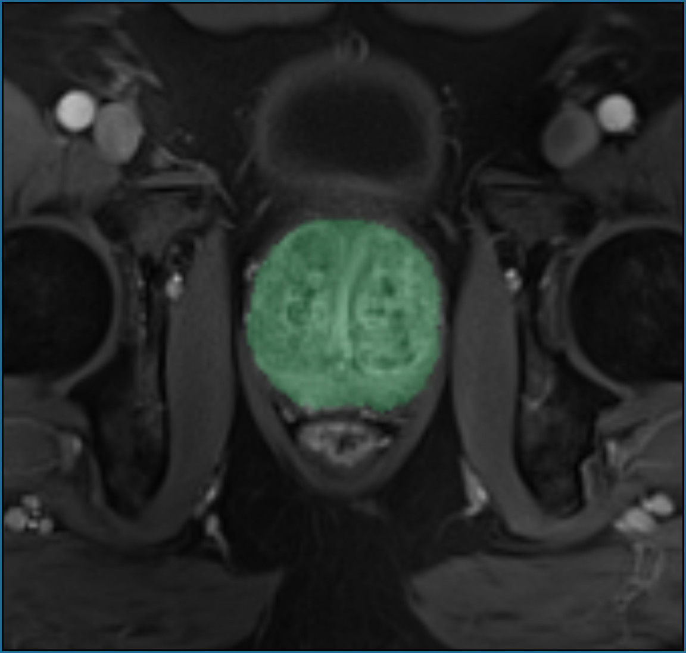

# mercure-exampleinference
Example module demonstrating the inference of a DL-based segmentation model

## Purpose

This module demonstrates how an AI-based image-processing model can be integrated and deployed with mercure. The module performs a simple slice-by-slice UNET-based segmentation of the prostate and creates a colored segmentation map that is blended with the input images. The module has been written in Python and uses ONNX Runtime as inference engine. Training of the model has been done using the fast.ai / PyTorch libraries, and the model has been exported in the ONNX format. The source code can be used as template for integration of own custom-developed models (in the current form, the processing is done slice-by-slice, but it should be straightforward to modify the code for volume-based processing).



**NOTE:** Purpose of this module is solely to demonstrate how easily AI models can be deployed with mercure. This module should not be used for any practical application (the segmentation model has not been optimized and does not work too well).

## Installation

The module can be installed on a mercure server using the Modules page of the mercure web interface. Enter the following line into the "Docker tag" field. mercure will automatically download and install the module:
```
mercureimaging/mercure-exampleinference
```

The following parameters can be set (via the Modules or Rules page):
```
color: Color of the segmentation overlay (name or #rrggbb code, default: yellow)
transparency: Transparency of the segmentation mask (default: 0.75)
series_offset: Offset added to series number (default: 1000)
```

The model expects T1-weighted 3D GRE prostate series with square image size (we used radial 3D GRASP DCE-MRI scans for training and testing).

## Sample Data

Using the script provided in the subfolder **/sampledata** of this repository, several public DICOM datasets can be downloaded and used to test the segmentation algorithm. These prostate datasets are different from the data used for training the segmentation model. Therefore, the segmentation results are not great, but the datasets suffice for demonstrating how the module works.

If using a Vagrant-based mercure installation, as described in the Quick Start section of the mercure documentation, execute the following steps to download the test data (otherwise, run the script directly in a bash shell on the Linux server):

1. Copy the script **download_sampledata.sh** into the root folder of the Vagrant installation (where the file Vagrantfile is located)
2. Open an SSH shell by typing
```
vagrant ssh
```
3. Run the download script by calling
```
cd /vagrant
./download_sampledata.sh
```
4. Leave the shell by typing 
```
exit
```
The sample dataset can now be found in the subfolder **sampledata** of the Vagrant folder. 

To send the datasets to your mercure server, use the dcmsend tool from the Offis DCMTK package, which can be downloaded under this link:
https://dicom.offis.de/download/dcmtk/dcmtk366/bin/


## Modification

To use the module as template for integration of own custom-developed models, clone the Git repository into your development environment. Edit the Makefile and replace the tag "mercureimaging/mercure-exampleinference" with a tag of your choice (use the name of your own organization in place of "mercureimaging", which will allow you to publish the container image on Docker Hub later). Afterwards, you can build the Docker container locally by calling the "make" command, and you can test the container in mercure by installing the module on the Modules page using the changed tag name. Source-code level modifications need to be done in the file interface.py. If you rename this file, make sure to adapt also the file docker-entrypoint.sh, which is the entry function called by mercure. If you use additional Python libraries, add these libraries to the file requirements.txt to ensure that they get installed when building the container image.

**Note:** Make sure to enable the Git LFS (Large File Storage) extension when including machine-learning models into your repository, as typical model files are too large to be stored in regular GitHub repositories.
